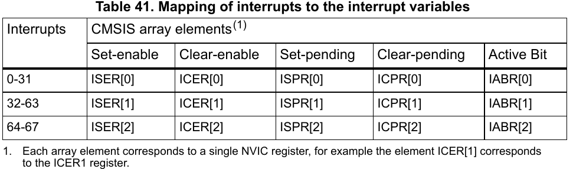
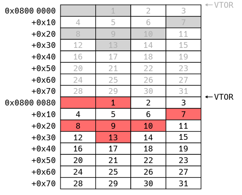

# A QUICK(ish) LOOK AT STM32 HARDWARE SECURITY (PART 1)

***9/12/21***

***Having been working with IoT software and firmware for little more than 2 years now. I realized I haven't poke the undelying hardware (CPU, MCU, busses...). Sure, I do interract with them with various predefined protocols and sometime program them, but have little idea of how they actually work and what threat model might be, so I decided to take a look at hardware security. Started with cve-2020-8004.***

## 1. CVE-2020-8004 Briefing

I remembered reading the CVE's description for the first time last year while handling threat intelligence ticket, I was quite intrigued because how software like it is and only need to be triggered from a debugger.

Anyway, the authors have already written a detailed description of how they work in \[[1]\], all future reference to the vulnerability will be taken from this article.

This vulnerability, in short, will allow attacker to dump most of the flash memory of STM32F1 devices, even if they are read protected, without any special hardware manipulation.

With that in mind, I want to approach this as a developer. That means reading through all the relevant documents provided by manufacturer, make simple program on the platform then exploit, probably create a CTF challenge in the process.

And naturally when it come to STM32F1, you test things on a bluepill board.

## 2. Target - GNUK

At first, my goal was to make a simple program that generate RSA keys, store them on the device flash memory then first poke it with the PoC to see how far I get, but I want a more sophisticated, real world target. So after a bit of researching I found GNUK - A cryptographic USB token implementation usable on STM32F1.

### 2.1 Setup

To create the USB token just compile the code then flash to the board.

```sh
./configure --vidpid=234b:0000 --enable-factory-reset --target=BLUE_PILL
make
st-flash write --flash=128k ./gnuk.bin 0x08000000
```

Steps to generate and setup key pairs available at \[[2]\].

**NOTE**: VMware need a bit more work to setup USB passthrough \[[3]\] . Open vmx file and add the following:

```
usb.generic.allowHID = "TRUE"
usb.generic.allowLastHID = "TRUE"
usb.quirks.device0 = "0x234b:0x0000 allow"
```

## $2\frac{1}{2}$. PoC Test Run

Connect our device with PC using usb and stlink v2 debugger via SWD
Launch openocd

```sh
openocd -f interface/stlink-v2.cfg -f target/stm32f1x.cfg
```

```sh
python3 ./main.py 0x08000000 10
Traceback (most recent call last):
  File "./main.py", line 250, in <module>
    num_exceptions = 16 + determine_num_ext_interrupts(oocd)
  File "./main.py", line 179, in determine_num_ext_interrupts
    exception_number = xpsr & 0x1ff
TypeError: unsupported operand type(s) for &: 'NoneType' and 'int'
```

This might or might not happend to you, but just in case...

What went wrong here is xPSR is none but the code expects it to hold some value. But lets put this aside for now, as it is not related to the PoC and we need to understand whats going on first.

## 3. Diving In

Before getting in the details, I must warn you that the *developer way* approach that I went is a *terrible* way to learn this. It's best to read a comprehensive overview \[[6]\] first. Then you can read official documents by ST \[[4]\] \[[5]\].

I might use interrupt and exception interchangebly in this article.

### 3.1 Exception Model

I won't repeats what is already in \[[6]\]. If you are unfamiliar to STM32 exception model or ARM exception model in general, read the following sections in \[[6]\]:

- ARM Exception Model Overview
- Registers used to configure Cortex-M Exceptions

Keynote from the vulnerability:

- Upon receiving exception, the vector table value of the coresponding exception in exception vector table is read to PC.
  - Exception vector table is a list of pointers in memory, when an exception occurs, a value in the table is read to PC, determined by predefined offset.
  - Read \[[5]\], chapter 10.1.2, table 61 for full table.
  - There are 16 internal exceptions, defined by ARM and up to 68 additional interrupts according to \[[5]\], although ARM document allow define up to 496 external interrupts.
  - Method of obtaining true number of supported external interrupt will be covered in the next section.
- Exception vector table location can be set using Vector table offset register (VTOR). There is a 8 bit (128 words - 64 pointers) address alignment requirement according to \[[4]\], but does not seem to be enforced.
- There are position in the exception table which is reserved -> cannot be triggered.

### 3.2 Determine Number of Interrupt

Now with the basics covered. Lets go back to part 2.5 where our PoC does not run. Took me lots of time to figure this out. This is nothing related to the vulnerability itself but openocd TCL issue.

- In \[[7]\], openocd TCL processes everything as strings. As such, we can send multiline command and end with byte 0x1a, same for data read back from openocd.
- Debugging the PoC, the data that are read back only contain 0x1a, empty string. Turn out command need to be wrapped in *capture* to get data back from TCL. Later version might not need this.
- Patched call in openocd.py:

    ```py
    data = ('capture "' + cmd + '"' + OpenOcd.COMMAND_TOKEN).encode('utf-8')
    ```

Back to the main topic.

To determine number of interrupt supported. ARM cortex-M3 has a register called *Interrupt Controller Type Register (ICTR)* \[[6]\] at 0xE000E004. Data can be read from the last 4 bits then calculated.

>32 * (INTLINESNUM + 1)

Needless to say granularity of 32 is not what we wanted. The PoC author does thing a litte differently:

- First openocd interrupt masking need to be disabled as we want to break within interrupt service routine.
- During isr execution, exception number can be read from either *Interrupt Control and State Register (ICSR)* or IPSR field of *Program Status Register (xPSR)*.
- To get the number of interrupts available. The PoC enumerate through all possible interrupt number, enable and set them to pending state using *Interrupt Set-Enable (NVIC_ISER)* and *Interrupt Set-Pending (NVIC_ISPR)* (check NVIC section in \[[6]\])
  - If an interrupt is valid then we can read it number form ICSR or IPSR else 0 is read.

A bit more details about how to trigger external interrupts:

>Four of the register types have a single bit allocated per external interrupt. Each type is in a contiguous bank of 32-bit registers. So if we want to configure external interrupt 65, the configuration will be bit 1 of the 3rd 32-bit register in the bank. Recall external interrupts start at offset 16 in the vector table so the Exception Number (index in the vector table) for this interrupt will be 16 + 65 = 81.

By ARM definition these are the regiter bank of NVIC registers. These register banks lie in their own contiguous address range:

- Interrupt Set-Enable (NVIC_ISER) and Clear-Enable (NVIC_ICER) Registers
  - NVIC_ISER0 - NVIC_ISER15: 0xE000E100 - 0xE000E13C
  - NVIC_ICER0 - NVIC_ICER15: 0xE000E180 - 0xE000E1BC
  - Writing a 1 to the correct bit offset of the register pair will enable or disable the interrupt and a read will return 1 if the interrupt is enabled.
- Interrupt Set-Pending (NVIC_ISPR) and Clear-Pending (NVIC_ICPR) Registers
  - NVIC_ISPR0 - NVIC_ISPR15: 0xE000E200 - 0xE000E23C
  - NVIC_ICPR0 - NVIC_ICPR15: 0xE000E280 - 0xE000E2BC
  - Writing a 1 to the correct bit offset of the register pair will set or clear the pending state of the interrupt and a read will return 1 if the interrupt is already pending.

In truth, for STM32F1, only 3 register banks are supported, in \[[4]\], chapter 4.3.1, table 41:



**More NVIC register information can be obtain in \[[4]\], chapter 4.3**

Still, the PoC would not work with the current hardware configuration (bluepill + stlink v2). Thats because HLA transport protocol of stlink v2 does not support low level commands needed to disable interrupt masking, so we cannot break into isr during it execution -> ICSR interrupt number is always 0.

Blindly read addresses from exception table offset will also not work because we cannot confirm that its actually an isr.

The solution here is switch to debugger that support SWD protocol like jlink. The cost of a jlink debugger quite high, I might follow this article up with a more budget friendly setup guide if possible.

### 3.3 Triggering Exceptions & Read Vector Table Content

Triggering external interrupts (number >= 16) using the same method we used to determine number of interrupts, with NVIC_ISER and NVIC_ISPR.

For internal ARM exceptions (number < 16), refer to \[[1]\], *Exception Generation* section.

### 3.4 Relocate Vector Table

Little reminder that our goal with this vulnerability is to dump the MCU's flash content. Now that we understood how exceptions can be triggered and how to read vector table, we need to move exception vector table around to dump our data.

As said in the start of the section, exception vector table can be relocated using VTOR register. According to \[[8]\] this value must be a power of 2 and align to 7 last bit ( = 128 bytes alignment), however VTOR in STM32F1 document is align to the last 8 bit ( = 256 bytes alignment).

So because vector table size (in bytes) must be power of 2 and cover all exception => $2^x$ $\geq$ (number_of_exception * 4). That means number of exception is also power of 2:
> $2^y$ $\geq$ number_of_exception; with y = x - 2

The datasheet for STM32F1 stated that the device has 43 external interrupt + 16 internal exception, that makes a 59 interrupts in total. We can confirm this via enumuration as well. So actual table size for STM32F1 is 64.

Also stated before, there are exception values that cannot be triggered. Thus we can't extract their values. Or can we?

The PoC code and the PoC explaination given by the author confuses me and is not well explained. Lets take a look at the explaination first:

The author devides 64 interrupt table into two 32 entries table (possible because VTOR alignment is not enforced?). We will call 32 entries table and 64 endtries table half-table and full-table, respectively. Naturally the reserved entries are not accessible.



Why divide? to compensate for table size and number of interrupt supported. Remember table size >= interrupt, 64 > 59.

The next picture shows how to access those value from second table onward, by using previous table higher values. First table reserved values are still inaccessible.


This is the code snippet, vtor_address is address pointed to by VTOR, num_exceptions is the total number of exception in the table (here 59), table_size is actual table size calculated in number of exception =$2^x$ and 1 less than needed (2^(x+1)>=59), exception_number is our current exception number.

```py
# Use the wrap-around behaviour to generate an exception for an
# inaccessible vector table entry.
# This is only possible when the vector table is not aligned to its size
# and the device has enough exceptions.
if (vtor_address % (table_size * 2 * WORD_SIZE)) != 0 \
        and (exception_number + table_size) < num_exceptions:
    exception_number += table_size
```

`(table_size * 2 * WORD_SIZE) is true table size (in bytes).`

`vtor_address % (table_size * 2 * WORD_SIZE) != 0 checks if vtor_address points to start of new true table, if not true means we are at the second half-table.`

`exception_number += table_size adjust the current exception number to the next half-table. But we are already at the second half-table so it goes out-of-bound and wrap around.`

We need to make and test a few theory with the current PoC, as the reserved entries of all full-table is still unreadable.:

- Case 1: VTOR alignment IS enforced and access to unaligned entries will loop back to offset calculated FROM VTOR addess => then why we can't read 1st half-table entries? Can we just set VTOR to align then read out-of-bound?
- Case 2: Deduct from the previous image, every second half-table in a full-table is fully readable because we set VTOR to start of the full table and uses their real indices
- Case 3 if case 2 is true: Can we read the next full table reserved entries from the current second half-table?

This is confusing, I know, read that part again.

Testing:

- Case 1: Not possible because we need to serve the exception. Full table alignment won't have serve any excepton with number > 58
- Case 2: Work! the PoC decided not to do it and do warp around stuff for code uniformity, I guess.
- Case 3: No, thats how the current warp around work, so with each full table we won't be able to read reserved entries.

### 3.5 Dumping

With each full table of 64 entries, we lost 7 reserved entries (except for the first we lost 5) => Only about 89% firmware can be recovered with this method.

### 3.6 Whats Next?

During my research of this vulnerability. I came across sources say that STM32F1 line up also vulnerable to fault injection. I will make a post about it in the future.

## References

1. [https://blog.zapb.de/stm32f1-exceptional-failure/](https://blog.zapb.de/stm32f1-exceptional-failure/)
2. [http://www.fsij.org/doc-gnuk/index.html](http://www.fsij.org/doc-gnuk/index.html)
3. [https://support.yubico.com/hc/en-us/articles/360013647640-Troubleshooting-Device-Passthrough-with-VMware-Workstation-and-VMware-Fusion](https://support.yubico.com/hc/en-us/articles/360013647640-Troubleshooting-Device-Passthrough-with-VMware-Workstation-and-VMware-Fusion)
4. [https://www.st.com/resource/en/programming_manual/cd00228163-stm32f10xxx-20xxx-21xxx-l1xxxx-cortex-m3-programming-manual-stmicroelectronics.pdf](https://www.st.com/resource/en/programming_manual/cd00228163-stm32f10xxx-20xxx-21xxx-l1xxxx-cortex-m3-programming-manual-stmicroelectronics.pdf)
5. [https://www.st.com/resource/en/reference_manual/cd00171190-stm32f101xx-stm32f102xx-stm32f103xx-stm32f105xx-and-stm32f107xx-advanced-arm-based-32-bit-mcus-stmicroelectronics.pdf](https://www.st.com/resource/en/reference_manual/cd00171190-stm32f101xx-stm32f102xx-stm32f103xx-stm32f105xx-and-stm32f107xx-advanced-arm-based-32-bit-mcus-stmicroelectronics.pdf)
6. [https://interrupt.memfault.com/blog/arm-cortex-m-exceptions-and-nvic#arm-exception-model-overview](https://interrupt.memfault.com/blog/arm-cortex-m-exceptions-and-nvic#arm-exception-model-overview)
7. [https://openocd.org/doc/html/index.html](https://openocd.org/doc/html/index.html)
8. [https://developer.arm.com/documentation/ddi0403/d/System-Level-Architecture/System-Level-Programmers--Model/ARMv7-M-exception-model](https://developer.arm.com/documentation/ddi0403/d/System-Level-Architecture/System-Level-Programmers--Model/ARMv7-M-exception-model)

[1]: https://blog.zapb.de/stm32f1-exceptional-failure/
[2]: http://www.fsij.org/doc-gnuk/index.html
[3]: https://support.yubico.com/hc/en-us/articles/360013647640-Troubleshooting-Device-Passthrough-with-VMware-Workstation-and-VMware-Fusion
[4]: https://www.st.com/resource/en/programming_manual/cd00228163-stm32f10xxx-20xxx-21xxx-l1xxxx-cortex-m3-programming-manual-stmicroelectronics.pdf
[5]: https://www.st.com/resource/en/reference_manual/cd00171190-stm32f101xx-stm32f102xx-stm32f103xx-stm32f105xx-and-stm32f107xx-advanced-arm-based-32-bit-mcus-stmicroelectronics.pdf
[6]: https://interrupt.memfault.com/blog/arm-cortex-m-exceptions-and-nvic#arm-exception-model-overview
[7]: https://openocd.org/doc/html/index.html
[8]: https://developer.arm.com/documentation/ddi0403/d/System-Level-Architecture/System-Level-Programmers--Model/ARMv7-M-exception-model

